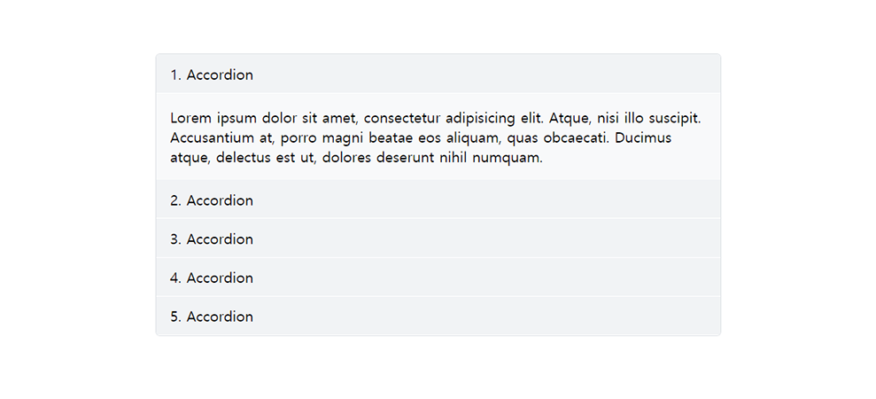

# jQuery-Accordion

### License
MIT license - http://opensource.org/licenses/MIT



### Set up

```html
<!-- acc.css -->
<link rel="stylesheet" href="./acc.css">

<!-- jQuery & acc.js-->
<script src="./jquery-3.1.1.min.js"></script>
<script src="./acc.js"></script>
<script>
      $(document).ready(function(){
            $('.accordion').acc();
      });
</script>
```


### Html
```html
<div class="accordion">
      <div data-acc-title="1. Accordion">
      Lorem ipsum dolor sit amet, consectetur adipisicing elit. Atque, nisi illo suscipit. Accusantium at, 
      porro magni beatae eos aliquam, quas obcaecati. Ducimus atque, 
      delectus est ut, dolores deserunt nihil numquam.
      </div>

      <div data-acc-title="2. Accordion">
      Lorem ipsum dolor sit amet, consectetur adipisicing elit. Atque, nisi illo suscipit. Accusantium at, 
      porro magni beatae eos aliquam, quas obcaecati. Ducimus atque, 
      delectus est ut, dolores deserunt nihil numquam.
      </div>

      <div data-acc-title="3. Accordion">
      Lorem ipsum dolor sit amet, consectetur adipisicing elit. Atque, nisi illo suscipit. Accusantium at, 
      porro magni beatae eos aliquam, quas obcaecati. Ducimus atque, 
      delectus est ut, dolores deserunt nihil numquam.
      </div>
</div>

```
_ _ _

### Options
```
$('.accordion').acc({
                speed :'fast',      //Number or String [slow, normal, fast] / (Default : 'fast')
                event : 'click',    //String [click, dblclick, mouseover, hover] / (Default : 'click')
                all_unfold: false    //boolean / (Default : false)
});
```
_ _ _

### Custom Style
```
/*wrap*/
.acc-wrap{border-radius:15px; border:1px solid #ced4da;}

/*title*/
.acc-title{padding:10px 15px; background:#f1f3f5; border-bottom:1px solid #ffffff;}

/*contents*/
[data-acc-title]{background:#f8f9fa; padding:15px;}
```
